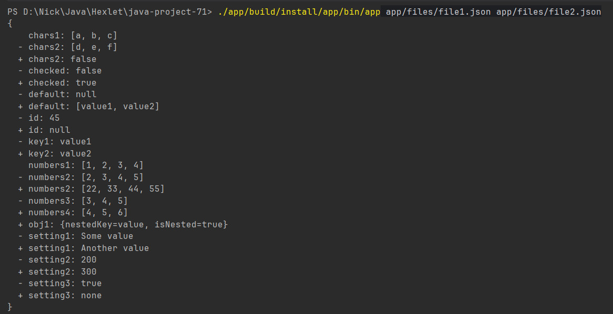
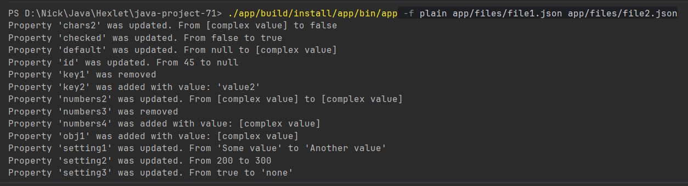

### Hexlet tests and linter status:
[](https://github.com/necasper/java-project-71/actions)

### CI build:
[](https://github.com/necasper/java-project-71/actions/workflows/build.yml)

### SonarCloud:
[](https://sonarcloud.io/summary/new_code?id=necasper_java-project-71)
[](https://sonarcloud.io/summary/new_code?id=necasper_java-project-71)

### Запуск утилиты (Windows / PowerShell)

Сборка и бинарники лежат в каталоге **`app`**. Сначала `cd app`, затем `.\gradlew.bat installDist`. Запуск через **`app.bat`**, не через `app`:

```text
.\build\install\app\bin\app.bat -f plain files\nested1.json files\nested2.json
```

Из корня репозитория: `.\app\build\install\app\bin\app.bat …` и пути к JSON вида `.\app\files\…`.

json:


yml:


stylish:


plain:
